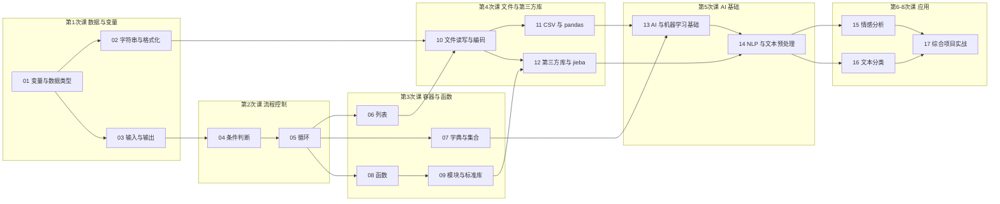

# 概念学习资料 · 目录

> 《大数据与人工智能》课程 ｜ 17 个概念 ｜ 每个概念一份资料，按「前置 → 后续」建立知识网络。
> 学习地图总览见 [../学习地图/learning-map.md](../学习地图/learning-map.md)。

## 概念关系图

> 箭头方向 = 依赖方向：`A → B` 表示"先学 A，才能学 B"。

## 目录与链接

### 阶段一 · Python 核心语法

**第 1 次课 · 数据与变量**
- [01 变量与数据类型](01-变量与数据类型.md) ｜ 前置：无 ｜ 后续：02、03
- [02 字符串与格式化](02-字符串与格式化.md) ｜ 前置：01 ｜ 后续：10
- [03 输入与输出](03-输入与输出.md) ｜ 前置：01 ｜ 后续：04

**第 2 次课 · 流程控制**
- [04 条件判断](04-条件判断.md) ｜ 前置：03 ｜ 后续：05
- [05 循环](05-循环.md) ｜ 前置：04 ｜ 后续：06、07、08

**第 3 次课 · 容器与函数**
- [06 列表](06-列表.md) ｜ 前置：05 ｜ 后续：10
- [07 字典与集合](07-字典与集合.md) ｜ 前置：05 ｜ 后续：13
- [08 函数](08-函数.md) ｜ 前置：05 ｜ 后续：09
- [09 模块与标准库](09-模块与标准库.md) ｜ 前置：08 ｜ 后续：12

**第 4 次课 · 文件与第三方库**
- [10 文件读写与编码](10-文件读写与编码.md) ｜ 前置：02、06 ｜ 后续：11、12
- [11 CSV 与 pandas](11-CSV与pandas.md) ｜ 前置：10 ｜ 后续：13
- [12 第三方库与 jieba 分词](12-第三方库与jieba分词.md) ｜ 前置：09、10 ｜ 后续：14

### 阶段二 · AI 基础与应用

**第 5 次课 · AI 基础**
- [13 AI 与机器学习基础](13-AI与机器学习基础.md) ｜ 前置：07、11 ｜ 后续：14
- [14 NLP 与文本预处理](14-NLP与文本预处理.md) ｜ 前置：12、13 ｜ 后续：15、16

**第 6–8 次课 · 应用**
- [15 情感分析](15-情感分析.md) ｜ 前置：14 ｜ 后续：17
- [16 文本分类](16-文本分类.md) ｜ 前置：14 ｜ 后续：17
- [17 综合项目实战](17-综合项目实战.md) ｜ 前置：15、16 ｜ 后续：无

---

> 生成规范：由本地技能 `learning-material-generator` 按统一模板产出（[模板](../learning-material-generator/references/template.md) · [概念清单](../learning-material-generator/references/concept-list.md)）。
